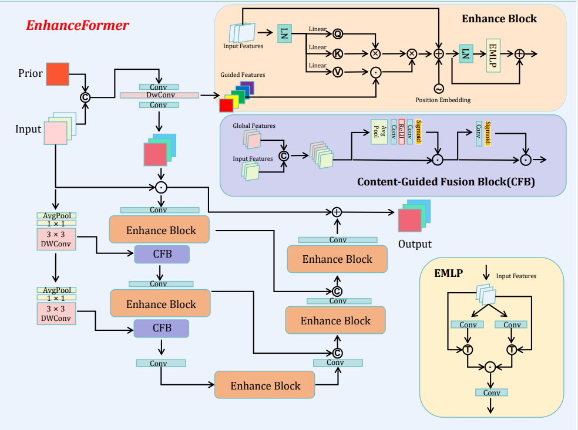

# MAI-2025-sRGB
My Solution for the Mobile AI 2025 Workshop sRGB Image Enhancement Challenge.(Pytorch)

My solution gets the competitve PSNR and SSIM against the winner's!
Conguatulations for our team that our solution was selected in CVPR 2025 Workshop!

The project is a tool for low light image enhancement or image enhancement. It is base on Retinexformer, which is a nice method for low light image enhancement.
You can use it for free.

